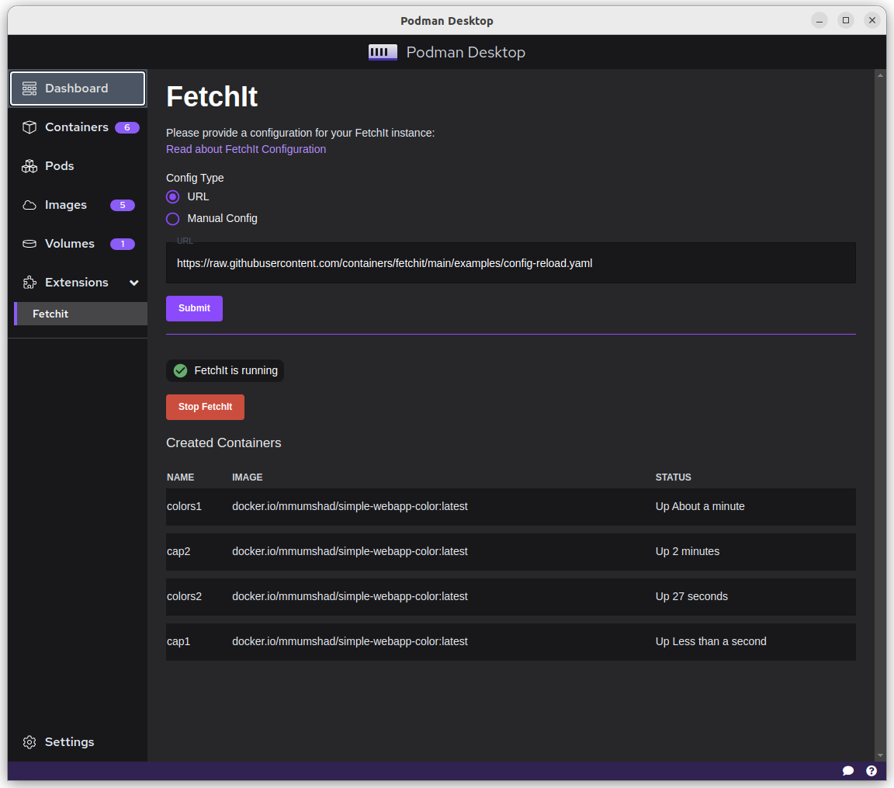
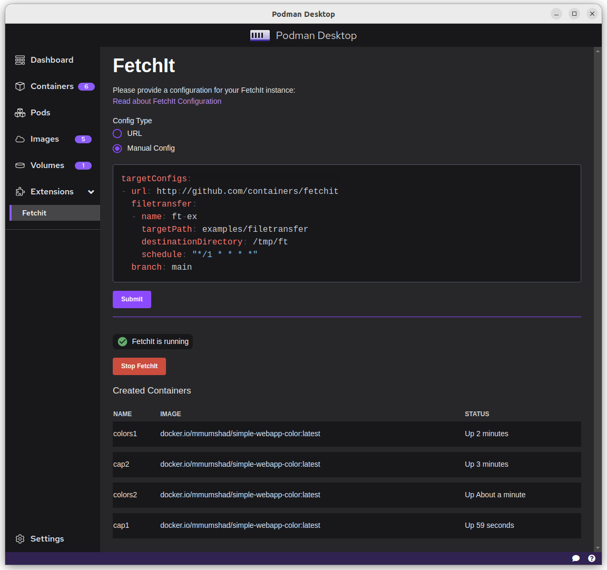
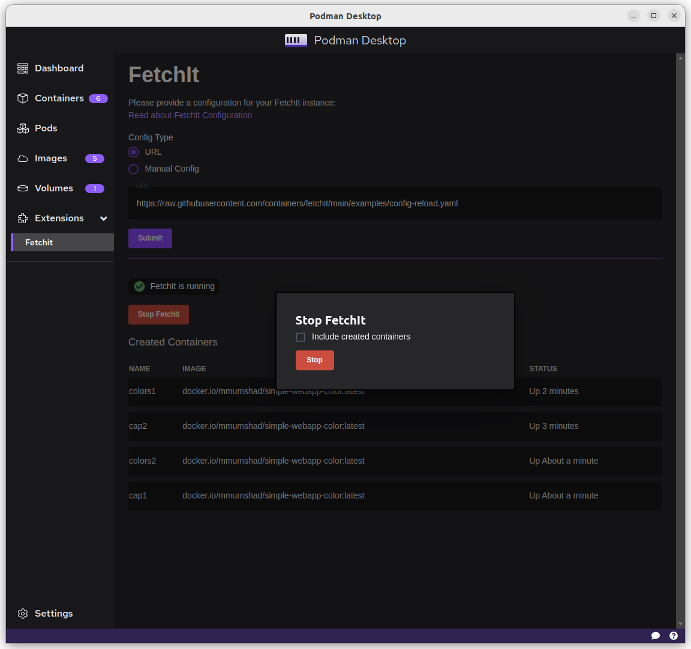

# FetchIt Podman Desktop Extension

This extension is a UI wrapper around FetchIt, providing a batteries-included experience for running applications with GitOps.

## Screenshots

<!--  -->

	

<!--  -->

	

<!--  -->

	

<!--  -->

## Features

The FetchIt Desktop Extension allows users to do the following:
- Configure applications using either a config hosted somewhere or manually provide a YAML
- Easily update & relaunch configurations
- See the current status of their FetchIt instance
- Stop FetchIt and cleanup created containers
- See a listing of FetchIt-created containers

## Requirements

- Podman version 4.x or higher
- Podman Desktop
- A system running Linux (other platforms are not currently supported but will be in the future)

## Installation

- With Podman Desktop open, Go to `Settings -> Desktop Extensions`
- Install the FetchIt Desktop Extension container: `docker.io/robotsail/fetchit-podman-desktop:latest`. 

## Usage

To use the extension, open it from the sidebar and provide your configuration.
You can either write a configuration manually, or provide a URL to an existing FetchIt configuration.

To update the configuration, simply provide the new one and resubmit it.
This will stop the current instance and launch another one using your new config.
For details on FetchIt configuration, please look at the [FetchIt Configuration Docs](https://fetchit.readthedocs.io/en/latest/methods.html).

## Updating

Since Podman desktop doesn't automatically download updates of extensions, you can update the extension by reinstalling the extension. To do this, simply do the following:

- Go to `Settings -> Desktop Extensions`
- Uninstall the existing FetchIt extension
- Install the FetchIt Desktop Extension container: `docker.io/robotsail/fetchit-podman-desktop:latest`

## Support

For any issues or feature requests, please [open an issue](https://github.com/RobotSail/fetchit-desktop-extension/issues/new). If your issue is with core FetchIt functionality, please [open an issue](https://github.com/containers/fetchit) on the [FetchIt Repo](https://github.com/containers/fetchit/issues/new).